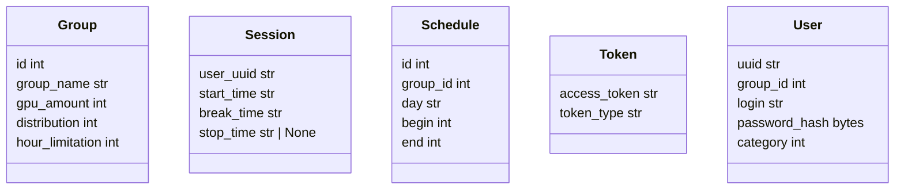

## 1.Требования ##
___
* Функциональные требования:
  * Существуют две главные роли: администратор и ученик/преподаватель
___
    * Админ может управлять доступными ресурсами
    * Админ может настраивать ограничения на использование(максимальное время выполнения задачи, ограничение по времени суток и дням недели)
    * Админ может добавлять пользователей, проставлять им роли и группы
___
    * Студент/преподаватель видит в какой группе он находится
    * Студент/преподаватель видит сколько GPU доступно в его группе
    * У студента/преподавателя есть возможность запустить своё решение, используя кнопки "Запустить" и "Остановить"
    * У студента/преподавателя есть возможность встать в очередь, если в данный момент времени свободного ресурса GPU нет
    * У студента/преподавателя есть возможность мониторить сколько еще времени на использование осталось

* Нефункциональные требования:
    * MVP
        * DAU:
        * RPS:
        * SLA:
    * Целевой продукт
        * DAU:
        * RPS:
        * SLA:
___
## 2.Границы системы ##
___
## 3.Компоненты системы и потоки данных ##
___
## 4. API, модель данных
* API

* Database

___
## 5. Выбор конкретных технологий ##
* Языки и стеки для Frontend
    * React.js 
* Языки и стеки для Backend
    * Python
    * FastAPI
* Реализация базы данных
    * SQLModel
___
## 6. Компоненты ##

